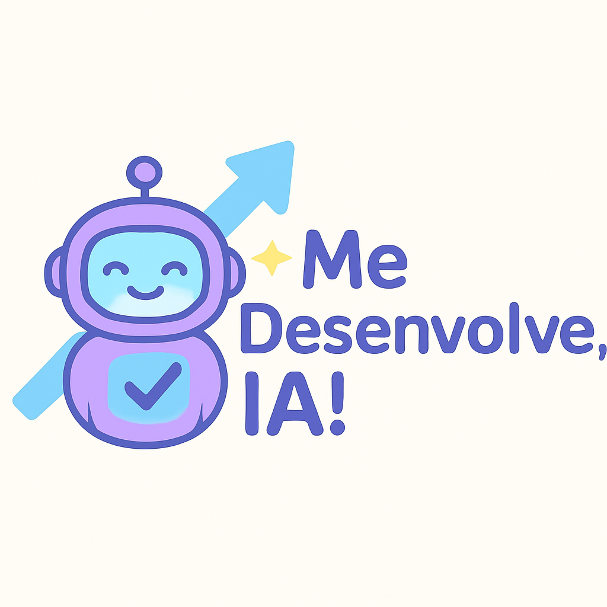

<p align="center">
    
    <h3 align="center">Me Desenvolve, IA!</h3>
</p>

<p align="center">
  Gerador inteligente de Plano de Desenvolvimento Individual (PDI) com IA generativa Gemini do Google.
</p>

## ✨ Me Desenvolve, IA!

O **Me Desenvolve, IA!** é um gerador inteligente de **Plano de Desenvolvimento Individual (PDI)** que utiliza o poder da IA generativa do Google, o **Gemini**, para ajudar profissionais a identificarem seus pontos fortes e oportunidades de melhoria.

Nesta primeira versão, o foco está na geração personalizada de planos práticos e acionáveis, com base nas respostas do usuário, aplicando a metodologia **SMART** para garantir clareza e efetividade.

Como evolução futura, planejamos incorporar uma Matriz de Competências para um diagnóstico ainda mais detalhado e orientado.

## 🧭 Contexto do Projeto

Este projeto nasceu durante a imersão promovida pela **Alura** e **Google**, com o objetivo de aplicar tecnologias de IA generativa para apoiar o desenvolvimento profissional de forma prática e acessível.

## 💼 Motivação

Construir um Plano de Desenvolvimento Individual (PDI) efetivo pode ser um grande desafio para muitos profissionais. Além da dificuldade natural de autoavaliação e falta de direcionamento claro, o processo tradicional de elaborar um PDI é geralmente demorado, complexo e exige muito esforço para traduzir habilidades em ações práticas e metas mensuráveis.

O **Me Desenvolve, IA!** surge para facilitar essa jornada, gerando planos personalizados, práticos e focados em resultados, poupando tempo e ajudando no crescimento contínuo com metas claras e atingíveis.

## 🎯 Metodologia SMART

Cada plano gerado pelo Me Desenvolve, IA! segue a metodologia SMART, ou seja, as metas são:

- **S**pecíficas (Específicas)
- **M**ensuráveis
- **A**tingíveis
- **R**elevantes
- **T**emporais

Isso garante que o usuário tenha clareza sobre o que deve ser feito e quando, aumentando as chances de sucesso.

## 📦 Como Executar

### 1. Configure a chave de API

No arquivo `appsettings.json`, insira sua chave da API Gemini:

```json
"GoogleGemini": {
  "ApiKey": "<COLOQUE_AQUI_O_SEU_API_KEY>"
}
```

> 🔐 A chave pode ser obtida via Google AI Studio.

### 2. Rode o projeto

No terminal, vá até o diretório da API e execute:
```
dotnet run --project MeDesenvolveIA.API.csproj
```
A API será iniciada em https://localhost:5008

### 3. Teste a chamada
Importe a coleção Postman disponível em:
```
docs/postman/MeDesenvolveIA.postman_collection.json
```

Exemplo de chamada:
POST http://localhost:5008/api/v1/pdis

Body:
```json
{
  "nome": "Camila",
  "cargoAtual": "Tech Lead",
  "cargoDesejado": "Arquiteta de Software",
  "habilidadesFortes": [
    "Liderança", "Mentoria", "Code Review"
  ],
  "habilidadesADesenvolver": [
    "Google Cloud", "Terraform", "C4 Model"
  ]
}
```
Exemplo de retorno:
```json
{
    "titulo": "Plano de Desenvolvimento Individual - Camila",
    "nome": "Camila",
    "cargoAtual": "Tech Lead",
    "cargoDesejado": "Arquiteta de Software",
    "empresaAlvo": "Atual ou similar com foco em cloud",
    "objetivoGeral": "Desenvolver as habilidades técnicas e de arquitetura de software necessárias para transição da posição de Tech Lead para Arquiteta de Software em até 12 meses, com foco em Google Cloud, Terraform e C4 Model.",
    "objetivosSmart": [
        {
            "objetivo": "Proficiência em Google Cloud Platform (GCP)",
            "descricao": "Adquirir conhecimento e experiência prática em serviços essenciais do GCP para projetar e implementar soluções escaláveis e robustas.",
            "specific": "Dominar os serviços principais do GCP, como Compute Engine, Cloud Storage, Cloud Functions, Cloud SQL e Kubernetes Engine (GKE).",
            "measurable": "Obter a certificação Google Cloud Certified Associate Cloud Engineer e implementar pelo menos dois projetos pessoais ou profissionais utilizando GCP.",
            "achievable": "Disponibilizar 5 horas semanais para estudo e prática, participar de cursos online e buscar mentoria de um arquiteto GCP.",
            "relevant": "O conhecimento em GCP é fundamental para a arquitetura de soluções modernas e escaláveis, alinhando-se com a direção estratégica da empresa.",
            "timeBound": "Concluir a certificação e os projetos em até 12 meses."
        },
        {
            "objetivo": "Dominar Terraform para Infraestrutura como Código (IaC)",
            "descricao": "Aprender a utilizar Terraform para automatizar a criação e gerenciamento de infraestrutura na nuvem, garantindo consistência e repetibilidade.",
            "specific": "Escrever e manter módulos Terraform para provisionar recursos no GCP, incluindo redes, máquinas virtuais e bancos de dados.",
            "measurable": "Criar um repositório GitHub com módulos Terraform reutilizáveis e automatizar a criação de um ambiente de desenvolvimento completo no GCP.",
            "achievable": "Realizar cursos online de Terraform, participar de workshops e praticar a automação de infraestrutura em projetos pessoais e profissionais.",
            "relevant": "Terraform é essencial para a automação e gerenciamento de infraestrutura na nuvem, otimizando custos e reduzindo erros manuais.",
            "timeBound": "Criar o repositório e automatizar o ambiente de desenvolvimento em até 9 meses."
        },
        {
            "objetivo": "Aplicar o C4 Model para Documentação de Arquitetura",
            "descricao": "Aprender e aplicar o C4 Model para criar diagramas claros e concisos que representem a arquitetura de software em diferentes níveis de abstração.",
            "specific": "Utilizar o C4 Model para documentar a arquitetura de um sistema existente e de um novo projeto, criando diagramas de contexto, contêiner, componente e código.",
            "measurable": "Apresentar a documentação da arquitetura para a equipe e receber feedback positivo sobre a clareza e utilidade dos diagramas.",
            "achievable": "Estudar a documentação do C4 Model, participar de workshops e aplicar o modelo em projetos reais, buscando feedback de outros arquitetos.",
            "relevant": "O C4 Model facilita a comunicação e compreensão da arquitetura de software, garantindo alinhamento entre as equipes de desenvolvimento.",
            "timeBound": "Documentar a arquitetura dos projetos e apresentar o feedback em até 6 meses."
        }
    ],
    "planoTrimestral": [
        {
            "trimestre": "Trimestre 1",
            "foco": "Fundamentos de Google Cloud e Terraform",
            "acoes": [
                "Realizar o curso online 'Google Cloud Fundamentals: Core Infrastructure'.",
                "Realizar o curso online 'Terraform for Beginners'.",
                "Criar uma conta gratuita no Google Cloud Platform.",
                "Configurar um ambiente de desenvolvimento local com Terraform.",
                "Implementar um projeto simples com Terraform para provisionar uma máquina virtual no GCP."
            ]
        },
        {
            "trimestre": "Trimestre 2",
            "foco": "Serviços Avançados do GCP e Automação de Infraestrutura",
            "acoes": [
                "Estudar os serviços de Cloud Storage, Cloud Functions e Cloud SQL no GCP.",
                "Implementar um projeto que utilize múltiplos serviços do GCP.",
                "Aprofundar o conhecimento em Terraform com o curso 'Terraform Associate Certification'.",
                "Criar módulos Terraform reutilizáveis para provisionar recursos comuns no GCP.",
                "Automatizar a criação de um ambiente de desenvolvimento completo no GCP."
            ]
        },
        {
            "trimestre": "Trimestre 3",
            "foco": "C4 Model e Certificação Google Cloud",
            "acoes": [
                "Estudar a fundo o C4 Model e suas diferentes camadas de abstração.",
                "Aplicar o C4 Model para documentar a arquitetura de um sistema existente.",
                "Participar de um workshop sobre C4 Model.",
                "Iniciar os estudos para a certificação 'Google Cloud Certified Associate Cloud Engineer'.",
                "Realizar simulados para a certificação."
            ]
        },
        {
            "trimestre": "Trimestre 4",
            "foco": "Aperfeiçoamento e Aplicação Prática",
            "acoes": [
                "Obter a certificação 'Google Cloud Certified Associate Cloud Engineer'.",
                "Aplicar o C4 Model para documentar a arquitetura de um novo projeto.",
                "Buscar oportunidades para aplicar os conhecimentos em GCP e Terraform em projetos da empresa.",
                "Mentorar outros membros da equipe em GCP e Terraform.",
                "Participar de eventos e conferências sobre arquitetura de software e cloud computing."
            ]
        }
    ],
    "recursosNecessarios": [
        "Acesso a cursos online ao Alura",
        "Conta no Google Cloud Platform",
        "Livros e documentação sobre Google Cloud, Terraform e C4 Model",
        "Software de diagramação (draw.io, PlantUML)",
        "Mentoria de um arquiteto de software experiente em GCP",
        "Tempo dedicado para estudo e prática"
    ],
    "metricasDeSucesso": [
        "Obtenção da certificação Google Cloud Certified Associate Cloud Engineer.",
        "Criação de um repositório GitHub com módulos Terraform reutilizáveis.",
        "Implementação de projetos pessoais e profissionais utilizando GCP e Terraform.",
        "Aplicação do C4 Model para documentar a arquitetura de software.",
        "Feedback positivo da equipe sobre a clareza e utilidade da documentação da arquitetura.",
        "Aumento da confiança e capacidade de projetar e implementar soluções escaláveis e robustas na nuvem."
    ],
    "observacoes": [
        "Este plano é um guia e pode ser ajustado de acordo com as necessidades e oportunidades que surgirem.",
        "É importante buscar feedback regularmente de colegas e mentores para identificar áreas de melhoria.",
        "O sucesso deste plano depende do comprometimento e dedicação da Camila.",
        "Buscar oportunidades para aplicar o conhecimento adquirido em projetos reais é fundamental para o desenvolvimento das habilidades."
    ]
}
```

## 🚀 Próximos Passos

- Implementar Matriz de Competências para diagnóstico mais preciso
- Desenvolver integração com Google Agenda para acompanhamento e lembretes automáticos das metas definidas
- Criar interface web para facilitar o acesso
- Adicionar dashboard visual para acompanhamento do progresso

## 📜 Créditos

Logo criada a partir de IA especialmente para o projeto.
